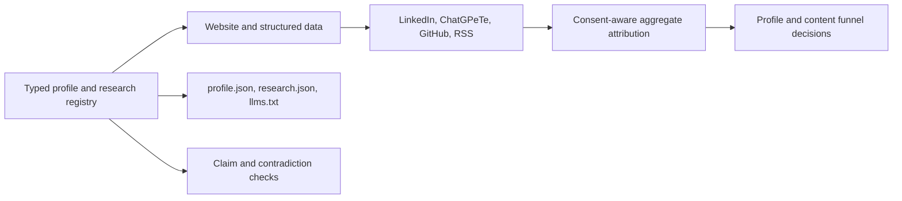

# PeteWebsite

The canonical portfolio and research archive for [Pete Ghiorse](https://peterghiorse.com/?utm_source=github&utm_medium=referral&utm_campaign=profile_visibility&utm_content=readme_badge), Group Product Manager for AI/ML, founder of Honeydew, and hands-on builder.

> I lead AI/ML products, build production agents, and publish rigorous evaluations of how they behave.

[Selected work](https://peterghiorse.com/projects) · [Résumé](https://peterghiorse.com/resume.pdf) · [Research and essays](https://peterghiorse.com/blog) · [Contact](https://peterghiorse.com/contact)

## What this system proves

- **Product judgment:** selected work is organized around the problem, Pete's role, the method, what changed, and what remains private or uncertain.
- **Technical fluency:** Astro, TypeScript, structured data, consent-aware attribution, automated claim checks, RSS, and reproducible research links.
- **Editorial rigor:** dated methods, negative results, limitations, correction history, and an explicit AI-use standard stay beside the conclusions.
- **Distribution discipline:** the website is canonical; ChatGPeTe, LinkedIn, GitHub, RSS, and machine-readable files point back with aggregate source attribution.

## Public evidence

| Question | Article | Methods repository |
| --- | --- | --- |
| When should an agent stop rather than act? | [Six-model restraint study](https://peterghiorse.com/blog/llms-knowing-when-to-stop) | [`agent-restraint-evals`](https://github.com/pghio/agent-restraint-evals) |
| Which model fits one production-shaped workload? | [2,800-call benchmark](https://peterghiorse.com/blog/llm-benchmark-stop-defaulting-to-the-frontier) | [`llm-agent-benchmark`](https://github.com/pghio/llm-agent-benchmark) |
| What can a small LLM-referral sample support? | [90-day discoverability field note](https://peterghiorse.com/blog/llm-discoverability-research) | [`llm-discoverability-field-note`](https://github.com/pghio/llm-discoverability-field-note) |

## Architecture



The canonical identity, dates, approved claims, study snapshots, limitations, and inbound links live in [`src/data/profile.json`](src/data/profile.json). Generated public summaries expose only current profile facts and explicitly dated research snapshots.

## Quality gates

```bash
npm ci
npm run check
npm run build
```

The combined check covers registry synchronization, prohibited claims, research denominators, aggregate attribution, and privacy behavior. CI runs the same check and production build on every pull request.

## Measurement and privacy

The site uses consent-gated GA4 measurement (`G-0JQ5NNRQM2`) and stores only an allow-listed, session-scoped first-touch record. Names, email addresses, person tokens, full referrer URLs, and arbitrary query parameters are rejected. See [`docs/referral-measurement.md`](docs/referral-measurement.md).

## AI use and ownership

AI assists with implementation, research retrieval, red-teaming, data checks, and editing. Pete remains accountable for accepted code, product decisions, source selection, evaluation design, factual claims, and published language. See [`AI_USE.md`](AI_USE.md).

## Local development

Requires Node.js 22.12 or newer.

```bash
npm ci
npm run dev
```

The two-page public résumé is generated by `scripts/generate-resume-pdf.py`; its final site artifact is `public/resume.pdf`.

## Licensing

Software source code is licensed under [Apache-2.0](LICENSE). Unless a file says otherwise, essays, résumé content, original illustrations, photographs, and video remain copyright Pete Ghiorse, all rights reserved. See [`CONTENT_LICENSE.md`](CONTENT_LICENSE.md).
